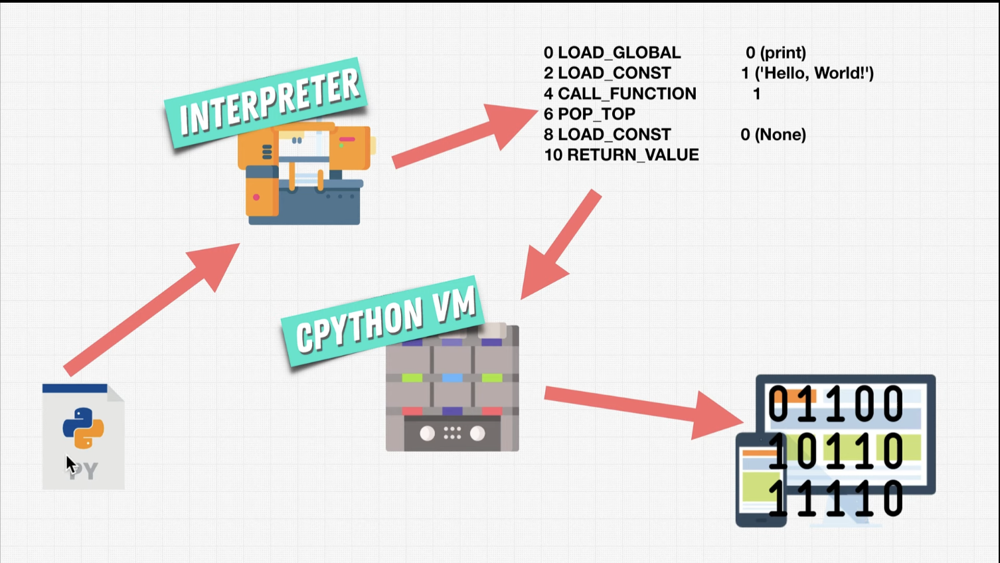

## Notes
- Two types of languages: interpreter (executes line by line) and compiler (execute all lines)
- Human readable set of instructions go through the translator (interpretor or compiler) then executes by computer
- When you download from python.org it's actually an interpreter based on cpython (ie. using c). This cpython will create something like a byte code.
- Python2 vs Python3 (if you updated to python 3 then anything written in python 2 will not work). Python2 code is referred to as legacy code.

